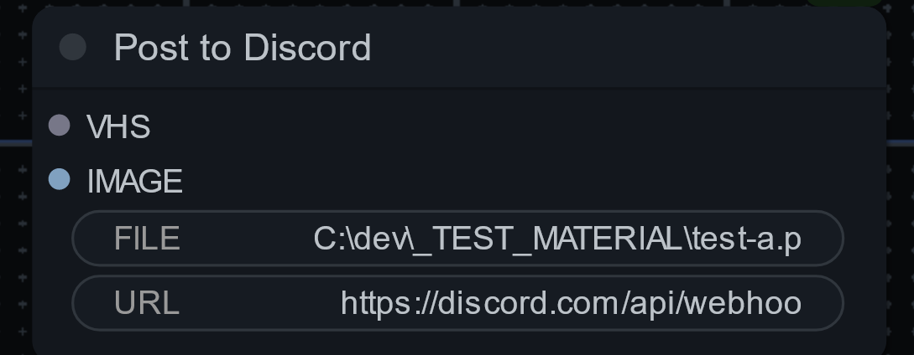

# PURPOSE

Some simple communication nodes.

## DISCORD

### Post Images or Video

Simply add the webhook url for your Discord channel, plug in an image, and the output will be posted.

<b>THE DEFAULT ORDER OF PREFERENCE IS TO PROCESS VHS then IMAGE then FILE.IT WILL SEND THE FIRST INPUT THAT HAS DATA.</b>

The VHS input will take direct filename input from [Video Helper Suite output  nodes](https://github.com/Kosinkadink/ComfyUI-VideoHelperSuite).

The IMAGE input will take a single or batch of images.

*NOTE*: The node will attempt to load all images sent. [There are throttle limits on Discord channels](https://support-dev.discord.com/hc/en-us/articles/6223003921559-My-Bot-Is-Being-Rate-Limited).

The FILE input allows you to directly send a file to the discord channel.

#### EXAMPLE USAGE

